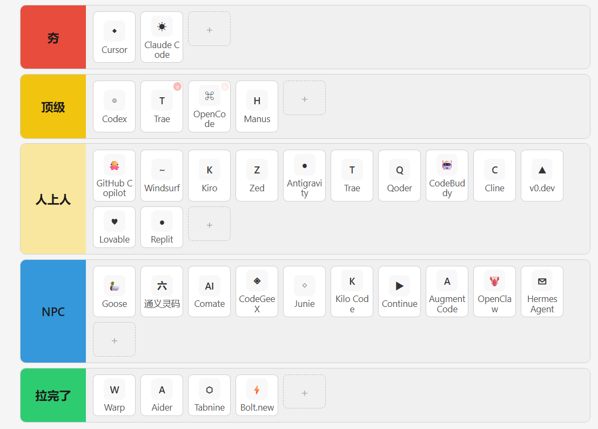
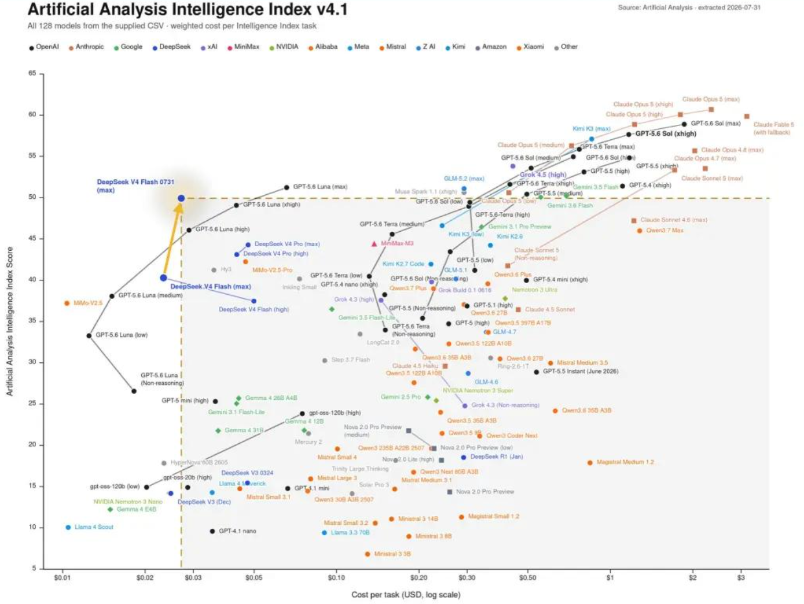
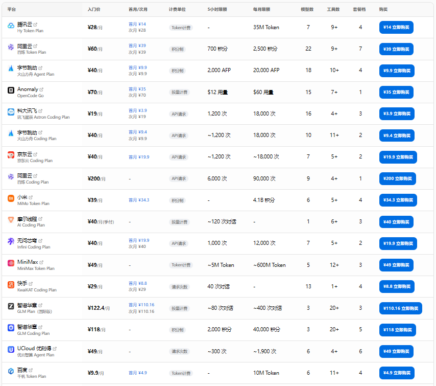
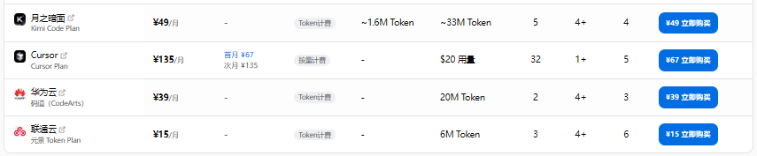

## 8月，AI Coding工具使用经验总结（个人薅羊毛版）
1、工具类型分类：
- CLI（opencode、cluade code、codex cli等）；
- 编辑器（基本都是基于vsCode魔改的，国内三厂：字节trae、腾讯codebuddy、阿里Qoder）；
- 工作台（codex、claude、workbuddy）；
- 龙虾（其实就是一堆md，代表：openclaw、hermes）；
- 工作流（扣子、combi）；
下图是某博主对当前主流的一些AI Coding工具从夯到拉的评价：

2、本人常用编辑器或工具：trae 、 codebuddy、opencode
- trae：1月-6月，一直是免费的，除了排队人数越来越多，没花一分钱，6月开始限流，8月开始积分值，免费500积分。
    **使用体验**：一开始做web小工具和小任务感觉还行，但遇到较难的问题，往往很多轮对话都找不到问题所在，只能我自己看代码来找。 它内置的AI可能都规定了输入和输出限制，导致很多问题，随便编一个理由就说解决了，也不验证就结束。
- codebuddy：每月500积分，前几个月还有推广的2000福利。
    **使用体验**：现在主要用这个编辑器，主要是它很少早停，一个问题可能运行半个小时一个小时都有可能，虽然也有可能没解决问题，但能解决问题的概率比trae大。
- opencode：每天限流，以前的免费额度还挺多的，这个月开始，随便用一下就用完了。
    **使用体验**：这个CLI感觉其底层Harness工程还行，应该是借鉴了claude code。常规的编程领域应该比trae、codebuddy要好，比如web开发。但没有界面的话，还是要通过编辑器来看它改了什么。另外管理model、skills、mcp这些有点儿麻烦，所以用得少，还是习惯编辑器；
	
3、Coding的大致流程：
	1）开发大的新功能前，先手写一大段需求，尽量描述清楚前端操作逻辑或算法逻辑；
    2）让AI先出一版功能prd，先把功能逻辑讲清楚，确认后再出一个设计文档，我确认或让它调整完一些决策点后，然后再开始开发；
	3）开发完后，可以让AI先写个测试用例，让它自己先测，写个测试报告，若有问题，让它自己先修；
	4）最后自己测，可以先根据AI写的测试用例测，它写的测试用例估计有些不符合实际，可能需要边改边测；
    5）改bug，这个是最耗时的，AI开发的功能，逻辑简单的还好，一般情况下都会有很多bug，需要自己测，测完后告诉AI所有的上下文，让它改。或者你一开始就对其功能和程序设计了熟于胸，这样能及时发现它做得不对的地方。最好不要让它独自一条路开发到底，后面的bug改不过来。

4、skills，感觉coding的时候AI很少能调用，可能coding的需求都比较个性化，估计比较难匹配上。感觉可能工作流之类的会容易匹配上（如生成+剪辑视频之类的固定流程）；

5、MCP：目前用得最多的就是Chrome DevTools MCP 和 mysql MCP。主要让AI自己调试web，自己用mysql数据库。 基本上遇到几轮都解决不了的bug的时候，让AI自己调用这俩工具自己排查，都能解决。  但Chrome  DevTools MCP调用次数多了之后上下文消耗的token太大。
- 另外，现在很多AI工具在推AI的“插件”机制，即将skills、system prompt、规则、mcp、hooks等打包起来给你用，比如“电子表格智能助手”，就需要各种工具、规则、skills的配合。我还没怎么用，以前试着配过system prompt，感觉效果一般般，就算了。

5、Memory：记忆，用的codebuddy自带的记忆系统方式；
- 一个主记忆MEMORY.md，最多只能有85行，超过后AI会自动去除不重要的，或再提炼一下；
- 每日开发都有开发日记，遇到了什么问题，是什么原因，通过什么方式解决，坑点是什么；这些都是编辑器自带的；
- Memory机制感觉还是可以，在我忘了前面做过什么的时候，翻一翻，还能想起来；AI干活时也会稍微看看，正确率也能提高一点。

6、上下文：各编辑器、AI工具如何拼接和管理上下文是AI Agent好不好用，省不省token的核心。
- 所谓的百万上下文，感觉上也没有使Agent变得更聪明，只是不用经常压缩上下文了；记不住的还是记不住；（见人见智）
- 上下文缓存命中：相似的问题或场景尽量在一个会话中，提高缓存命中率；但一个会话中对话次数过多也会影响效果，大概20轮对话可能就需要换个会话了；
- 订阅API的token消耗：长对话下，上下文越大，token消耗越快，往往后面一轮对话消耗的token是前面的好几倍；

7、Harness和模型的配合：如何读文件、怎么调终端、如何运行和测试，这些围绕模型运转的工程系统，统称为Harness。很多AI工具干的活就是把这些拼到上下文，然后再发给基座模型。但有些模型的工具调用、上下文管理和思考内容回放有自己的接口规则，所以有些时候用AI工具自带的模型，会比自己配API的兼容性高。

8、基座模型：现在确实一般用DeepSeek V4 Flash 0731版比较划算，效果也还行，但我用的时候，出现了几次循环回答的问题，可能是接入工具的Harness还不太匹配的问题。还有几次欺骗性回答，即它会自作聪明地用一些捷径来制造它已经解决了问题的假象，规避问题的实质。

**其他基座模型**：
- GLM系，前几个月用得比较多。glm-5.2做工作量大的任务确实还可以，出错的概率要小一点儿。
- MiniMax 3，用过一段时间，感觉思维比较活跃，有一些创意；
- kimi，以前只用过2.7，coding的感觉中规中矩，但网页上用查资料、写文章，或做点儿艺术相关的事，感觉还行。
- GPT，只用过网页版，回答风格一句一段的，比较符合人的阅读习惯；

9、当前个人包月订阅的部分API或工具价格：

