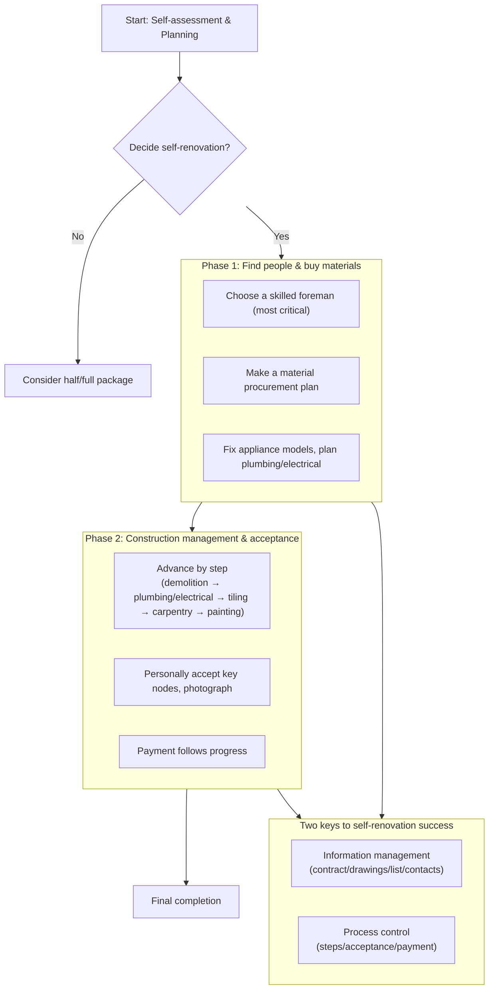

## Self-Managed Renovation Pitfall Handbook: From Start to Acceptance

Leading your own renovation means being your project's general manager, procurement manager, and supervisor. Upside: control, possible budget savings, self-chosen materials. Downside: time, coordination hassle, all responsibility on you. This guide gives a clear operating framework to hit fewer pitfalls.

### Core idea: from owner to project manager
Self-renovation succeeds when you act as the project manager. You don't work with your hands; your job is managing information, process, and people. Below is the core flow — your project map:

---

### Phase 1: Start & planning — think before you act

**1. Assess if you fit**
* Ask three questions:
    * Time: can you often take calls, coordinate, visit site on workdays?
    * Energy: patience to study materials/craft and handle surprises?
    * Character: communication, decision, stress tolerance?
    * Mostly "no" → reconsider self-renovation.

**2. Budget and needs list**
* Budget: total = hard renovation (labor + auxiliary) + main materials + furniture/appliances + soft furnishing + 15–20% contingency. This is your floor.
* Needs: detail each space's function, style, must-have appliances — the basis to talk with workers.

---

### Phase 2: Find people & buy materials — pick the right partners
The most tiring step; key is "right people" and "right goods."

**3. Choose a skilled foreman (most critical)**
* How to find: referrals from acquaintances (seen the work) first; then the community owner group's active crew.
* How to interview:
    * See the site: surprise-check his active plumbing/electrical or tiling; tidy? standard craft?
    * Ask details: for your layout, ask specific craft (e.g., waterproofing, tile laying).
    * Talk cooperation: confirm fixed plumbing/electrical/tiling/painting crew — affects handoff.
* How to lock: itemized quote (e.g., plumbing/electrical per meter/point) in the contract. Don't just look at total.

**4. Buy materials**
* Procurement plan: by construction order (demolition → plumbing/electrical → tiling → carpentry → painting) list materials and delivery times.
* Watch auxiliary: even if foreman supplies, write brand/model in contract (e.g., Far East flame-retardant BV wire, Weixing F-PPR pipe).
* Main material purchasing:
    * Big materials: compare at building-material markets; small items online.
    * Personally accept deliveries; verify model, qty, color.
    * Keep all receipts, color cards, samples for reordering and later checks.

**5. Plan plumbing/electrical**
* Fix embedded appliances, sanitary ware, lighting models/sizes; give electricians/plumbers the official install drawings.
* Personally join point marking; use chalk on walls for switches, sockets, water outlets; imagine life scenes and confirm one by one.

---

### Phase 3: Construction management & acceptance — be the supervisor

**6. Grasp key steps and acceptance**
* Demolition & new wall: confirm demolition spots; new wall needs mesh and rebar.
* Plumbing/electrical:
    * Accept materials match contract.
    * Supervise: pipes overhead, electrical above water; conduits straight; pressure test after pipe install (8kg, 30min no drop).
    * After completion, photograph/video whole-house plumbing/electrical for later repair.
* Waterproofing:
    * Bathroom wall waterproofing to 1.8m, shower zone to ceiling.
    * After membrane dries, 48h water test — visit downstairs neighbor to check leakage.
* Tiling:
    * Check hollow spots (center hollow of a tile → rework).
    * Check floor drain is lowest point, drainage smooth.
* Carpentry & painting:
    * Ceiling corners use one whole gypsum board "L" cut to prevent cracks.
    * Wall flatness (flashlight side-light at night), inside/outside corners square.

**7. Communication and payment**
* Daily communication: WeChat group with foreman, sync progress/issues daily.
* Changes in writing: any change confirmed in WeChat with price and method — no verbal.
* Payment rhythm: insist on "3331" or more conservative (30% start, 30% plumbing/electrical acceptance, 30% tiling/carpentry acceptance, 10% final after full completion). Money is your best management tool.

---

### Pitfall summary
1. Pay slowly: payment always behind accepted progress.
2. Write it down: all promises, quotes, changes in contract, quote, or chat records.
3. Don't touch what you don't know: central AC, fresh-air, floor heating — unless willing to study, use professional vendors.
4. Be present at key nodes: material arrival, plumbing/electrical acceptance, waterproof test, tile laying, final acceptance.
5. Trust but verify: respect workers, but don't compromise on craft standards.

Self-renovation is like a marathon — testing planning, execution, and adaptability. The more thorough the prep, the steadier your mindset. When you move into the home you built with your own hands, all the effort becomes a sense of achievement. Smooth renovation to you!
