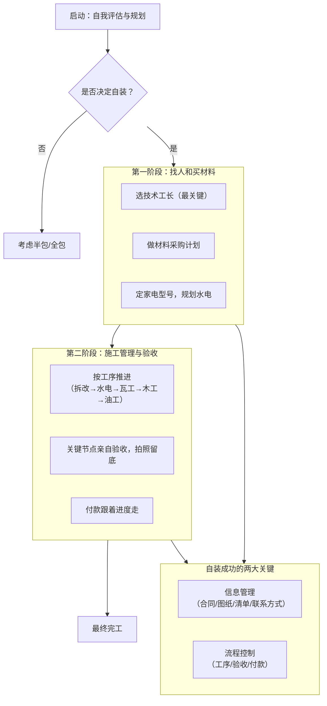

## 自装避坑手册：从启动到验收全攻略

自己主导装修，意味着你要当自家项目的总负责人、采购经理和监理。好处是控制权大、可能省预算、材料自己选，缺点是要投时间、协调麻烦、责任全在自己。这份指南给你一套清晰的操作框架，帮你少踩坑。

### 核心思路：从业主到项目经理

自装想成功，关键是把自己当成项目经理。你不用亲手干活，主要任务是管信息、管流程、管人。下面是自装的核心流程，相当于你的项目地图：

---

### 第一阶段：启动与规划——想清楚再动手

**1. 先评估自己适不适合**
*   问自己三个问题：
    *   时间：工作日能不能经常接电话、协调各方、跑工地？
    *   精力：有没有耐心研究材料和工艺，处理突发问题？
    *   性格：沟通、决策和抗压能力怎么样？
    *   答案多为“否”的话，慎重考虑自装。

**2. 做预算和需求清单**
*   预算：总预算 = 硬装（人工+辅材） + 主材 + 家具家电 + 软装 + 15%-20%备用金。这是你的底线。
*   需求：详细写下每个空间的功能、风格和必要电器，这是和工人沟通的基础。

---

### 第二阶段：找人和买材料——选对伙伴

这是最累的一步，关键是“选对人”和“买对货”。

**3. 选技术工长（最核心）**
*   怎么找：优先熟人推荐（亲眼看过活），其次在小区业主群找正在施工的工队。
*   怎么面试：
    *   看工地：突击检查他正在做的水电、瓦工活，看现场整洁不，工艺规范不。
    *   问细节：针对你的户型，问具体工艺（比如防水怎么做、瓷砖怎么贴）。
    *   聊合作：确认他有没有固定的水电、瓦、木、油工班底，这关系到衔接顺不顺。
*   怎么定：要分项报价单（比如水电按米/点位报价），写进合同。别只看总价。

**4. 买材料**
*   做采购计划：按施工顺序（拆改 → 水电 → 瓦工 → 木工 → 油工）列材料和进场时间。
*   辅材要盯：即使工长包辅料，也要在合同里写清品牌、型号（比如电线用远东阻燃BV线，水管用伟星F-PPR）。
*   主材采购：
    *   大材料去建材市场比价，小件可以网购。
    *   材料到场一定要亲自验收，核对型号、数量、颜色。
    *   保留所有单据、色卡、样板，方便补货和后期核对。

**5. 规划水电**
*   确定嵌入式家电、洁具、灯具的型号和尺寸，把官方安装图给电工水工。
*   亲自参与水电定位，用粉笔在墙上标开关、插座、水口的位置，想象生活场景逐一确认。

---

### 第三阶段：施工管理与验收——当好监工

**6. 把握关键工序和验收**
*   拆除与新砌：确认拆除位置，新砌墙要挂网、植钢筋。
*   水电改造：
    *   验收材料和合同一致不。
    *   监督施工：水管走顶、电上水下；线管横平竖直；水管装完做打压测试（8公斤压力，30分钟不掉压）。
    *   完工后，给全屋水电拍照录像，方便以后维修。
*   防水工程：
    *   卫生间墙面防水刷到1.8米高，淋浴区可以到顶。
    *   防水层干透后做48小时闭水试验，一定要去楼下邻居家看漏不漏水。
*   瓦工铺贴：
    *   检查瓷砖空鼓（单片中间空鼓要返工）。
    *   检查地漏是不是最低点，排水顺不顺。
*   木工与油工：
    *   检查吊顶转角是不是用整张石膏板做“L”型切割，防止开裂。
    *   检查墙面平整度（晚上用手电筒侧照），阴阳角直不直。

**7. 沟通和付款**
*   每日沟通：和工长建微信群，每天同步进度和问题。
*   变更要书面：任何改动，都要在微信里确认价格和做法，别口头说。
*   付款节奏：坚持“3331”或更保守的方式（开工30%，水电验收30%，瓦木验收30%，全部完工付10%尾款）。钱是你最好的管理工具。

---

### 避坑总结

1. 钱要慢给：付款进度永远晚于验收合格的工程进度。
2. 写下来：所有承诺、报价、变更，都要落在合同、报价单或聊天记录里。
3. 不懂别碰：中央空调、新风、地暖这些复杂系统，除非你愿意花时间研究，否则找专业供应商。
4. 关键节点必到：材料进场、水电验收、防水试验、瓷砖铺贴、竣工验收，一定要亲自去。
5. 信任但核实：对工人尊重，但工艺标准不能妥协。

自装像场马拉松，考验规划、执行和应变能力。前期准备越充分，过程中心态越稳。等你住进亲手打造的家，所有付出都会变成成就感。祝你装修顺利！